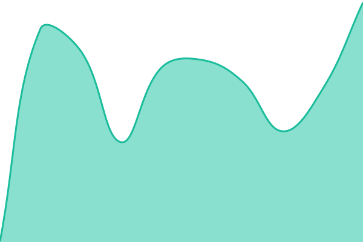
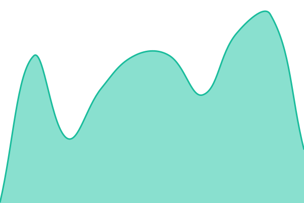
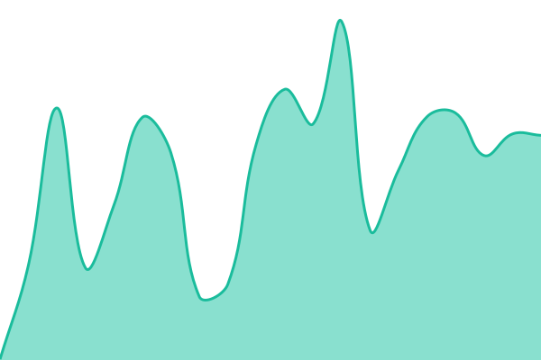
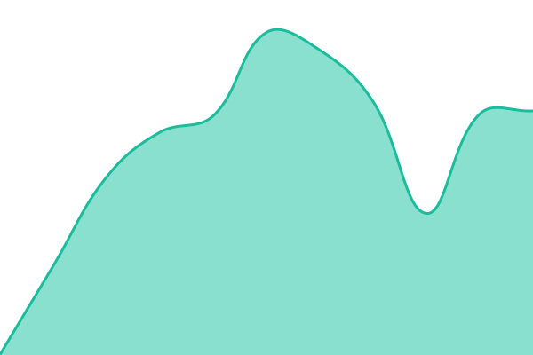
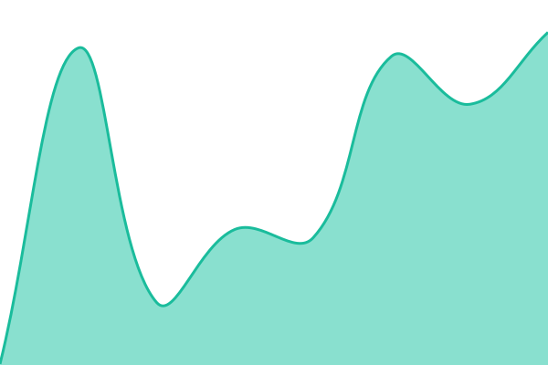

# [📈 Live Status](https://status.narabenefits.com): <!--live status--> **🟧 Partial outage**

The public uptime monitor and status page for the [Nara Health](https://www.narabenefits.com)
platform, published at **[status.narabenefits.com](https://status.narabenefits.com)** and powered by
[Upptime](https://github.com/upptime/upptime).

There is no server. [Actions](https://github.com/NaraBenefits/status-page/actions) run the checks,
[Issues](https://github.com/NaraBenefits/status-page/issues) are the incident reports, and
[Pages](https://status.narabenefits.com) serves the site.

<!--start: status pages-->
<!-- This summary is generated by Upptime (https://github.com/upptime/upptime) -->
<!-- Do not edit this manually, your changes will be overwritten -->
<!-- prettier-ignore -->
| URL | Status | History | Response Time | Uptime |
| --- | ------ | ------- | ------------- | ------ |
|  [Member Portal](https://app.narabenefits.com) | 🟩 Up | [member-portal.yml](https://github.com/NaraBenefits/status-page/commits/HEAD/history/member-portal.yml) | 

 273ms
     
 | 

<a href="https://status.narabenefits.com/history/member-portal">100.00%</a>
    

|  [Employer Portal](https://employer.narabenefits.com) | 🟥 Down | [employer-portal.yml](https://github.com/NaraBenefits/status-page/commits/HEAD/history/employer-portal.yml) | 

 0ms
     
 | 

<a href="https://status.narabenefits.com/history/employer-portal">27.48%</a>
    

|  [Provider Portal](https://provider.narabenefits.com) | 🟥 Down | [provider-portal.yml](https://github.com/NaraBenefits/status-page/commits/HEAD/history/provider-portal.yml) | 

 0ms
     
 | 

<a href="https://status.narabenefits.com/history/provider-portal">37.27%</a>
    

|  [ICHRA Portal](https://ichra.narabenefits.com) | 🟥 Down | [ichra-portal.yml](https://github.com/NaraBenefits/status-page/commits/HEAD/history/ichra-portal.yml) | 

 0ms
     
 | 

<a href="https://status.narabenefits.com/history/ichra-portal">63.36%</a>
    

|  [Platform API](https://api.narabenefits.com/health) | 🟩 Up | [platform-api.yml](https://github.com/NaraBenefits/status-page/commits/HEAD/history/platform-api.yml) | 

 244ms
     
 | 

<a href="https://status.narabenefits.com/history/platform-api">100.00%</a>
    

<!--end: status pages-->

[**Visit our status website →**](https://status.narabenefits.com)

---

## What is monitored

Every external Nara surface, checked from GitHub-hosted runners every 10 minutes. Anything slower
than 5s is reported as degraded rather than down.

| Service         | Slug              | Endpoint                      | Check                                                       |
| --------------- | ----------------- | ----------------------------- | ----------------------------------------------------------- |
| Member Portal   | `member-portal`   | `app.narabenefits.com`        | Front door, as a member reaches it (CloudFront + SPA shell) |
| Employer Portal | `employer-portal` | `employer.narabenefits.com`   | Front door, as an employer admin reaches it (ALB → ECS)     |
| Provider Portal | `provider-portal` | `provider.narabenefits.com`   | Front door, as a provider reaches it (ALB → ECS)            |
| ICHRA Portal    | `ichra-portal`    | `ichra.narabenefits.com`      | Front door, as an enrollee reaches it (ALB → ECS)           |
| Platform API    | `platform-api`    | `api.narabenefits.com/health` | 200 **and** a body containing `Healthy`                     |

Deliberately excluded, because they are internal and their availability is not something we publish:
`crm.`, `admin.` and `webhooks.`.

The portals are checked at their root rather than at `/health` on purpose: a status page should
answer "can someone use this right now", which includes DNS, TLS, the load balancer and the login
redirect. All three ALB-backed portals also expose a cheap `/health` liveness endpoint if a deeper
check is ever wanted alongside the front-door one.

## Changing what is checked

Edit [`.upptimerc.yml`](.upptimerc.yml) and push to `main`. **Setup CI** picks up the change,
regenerates the workflow files, refreshes the README table and redeploys the site — nothing under
`.github/workflows/` should ever be hand-edited, it is generated output.

`slug` is the primary key for a site: it names the history file, the graph directory, the API
directory and the per-service page on the website. Renaming a slug orphans all of that, so the slugs
here are deliberately domain-free and should stay fixed even as hostnames change.

There is one workflow here that Upptime did not generate:
[`mirror-master.yml`](.github/workflows/mirror-master.yml). `@upptime/status-page` hardcodes a
`master` ref when the browser fetches `history/summary.json` and the response-time graphs, and
neither `apiBaseUrl` nor `userContentBaseUrl` can redirect it — on a repository whose default branch
is `main`, the live status list comes up permanently empty. That workflow keeps `master`
fast-forwarded to `main`. Renaming the default branch to `master` would do the same thing and let the
file be deleted.

## Domain migration

> [!WARNING]
> The checks above target the post-migration hostnames, which do not resolve yet. Until the platform
> serves them, every service on this page reads **down**. This is deliberate — the page describes the
> target state — but do not read a red page as an outage before the cutover completes.
>
> Confirmed by the first `Uptime CI` run: `Could not resolve hostname` on all three curl attempts.
>
> The practical consequence, once `GH_PAT` exists: Upptime opens a `status` incident issue per
> service (`🛑 <Service> is down`), and they stay open until the hostname resolves. This is why
> `.upptimerc.yml` carries no `assignees` — five standing incidents are tolerable, five standing
> incidents that page a team are not. Restore `assignees: [NaraBenefits/admin]` after the cutover.

Where each hostname stands today:

| Hostname                    | State                                                                                                               |
| --------------------------- | ------------------------------------------------------------------------------------------------------------------- |
| `app.narabenefits.com`      | Zone exists and is delegated (`aws/htd1_867344455680/route53.tf` in `root-infrastructure`); no records, not serving |
| `api.narabenefits.com`      | Same — delegated, not serving                                                                                       |
| `employer.narabenefits.com` | No hosted zone                                                                                                      |
| `provider.narabenefits.com` | No hosted zone                                                                                                      |
| `ichra.narabenefits.com`    | No hosted zone                                                                                                      |

Each still serves from `avanthealth.ai` (`app.`, `app-api.`, `employer.`, `provider.`, `ichra.`).
Completing the cutover needs, per hostname: a hosted zone in the HTD1 account, an `NS` delegation
record in the parent `narabenefits.com` zone, an ACM certificate, and the domain wired into the
CloudFront distribution or ALB listener rule in `avantai-platform`'s `infra/terraform`. None of that
is in this repository.

`name` and `slug` carry no domain, so any further hostname change is a one-line `url` edit here with
uptime history, graphs and incident links intact.

## Incidents and maintenance

Upptime opens an issue labelled `status` plus the site slug when a check fails, comments on it while
it stays down, and closes it on recovery; issues open for under 15 minutes are deleted rather than
closed. Nobody is assigned automatically until `assignees` is restored after the cutover, so until
then incidents are found by watching the repository or `#platform-status`, not by being assigned.

Announce planned work with the **Scheduled maintenance** issue template. The HTML comment at the top
of that template is parsed, not decorative: `start`/`end` in UTC ISO-8601 and `expectedDown` /
`expectedDegraded` as comma-separated slugs. Failures inside the window are attributed to the window
instead of opening an incident.

> [!IMPORTANT]
> This repository is public and so is every issue in it. No member data — member IDs, names, DOBs,
> addresses, TINs, SSNs — in incident titles, bodies, comments or commit messages.

## Branding

Assets in [`assets/`](assets/) are copied verbatim into the site root at build time, which is how
they get their `https://status.narabenefits.com/...` URLs.

| File                                                                  | Role                                                                                                                     |
| --------------------------------------------------------------------- | ------------------------------------------------------------------------------------------------------------------------ |
| `nara-theme.css`                                                      | Colour theme (`status-website.themeUrl`). Custom properties only — Upptime's `global.css` loads after it.                |
| `nara-brand.css`                                                      | Typography and component styling (`status-website.links`), which loads after `global.css` and can therefore override it. |
| `nara-lockup-linen.svg`                                               | Navbar signature, Linen on the Forest bar.                                                                               |
| `nara-symbol-forest.svg`                                              | SVG favicon.                                                                                                             |
| `favicon.png`, `apple-touch-icon.png`, `logo-192.png`, `logo-512.png` | Raster icons; the `logo-*` pair overrides the ones Upptime ships.                                                        |
| `nara-icon-64.png`                                                    | Per-service icon in the table above and on the site, in place of the default DuckDuckGo favicon service.                 |
| `manifest.json`                                                       | PWA metadata, overriding Upptime's.                                                                                      |

Colours come from [`AvantHealth/nara-brand`](https://github.com/AvantHealth/nara-brand): Forest
`#0E3837` carries the navbar, Linen `#FFFBEC` the page, Leaf `#0A6F4F` marks up, Carrot `#FF8A45`
degraded. The palette has no red, so the down state uses one documented off-palette value
(`#B3261E`) — a status page has to distinguish "slow" from "broken" at a glance. Type is Instrument
Serif for headings and Inter for everything else, loaded from Google Fonts.

## Setup

Standing this repository up from scratch needs three things outside of it:

1. **A `GH_PAT` repository secret — required, nothing works without it.** Upptime is a bot that
   commits to its own repository: uptime history, response-time graphs, the README summary, the
   `gh-pages` deploy, its own workflow files, and an issue per incident. This repository's default
   `GITHUB_TOKEN` is read-only (`Contents: read`), so every Upptime workflow 403s — on `git push`,
   and on the `POST /issues` that opens an incident. Create a fine-grained personal access token
   scoped to this repository with read-write on **Actions, Contents, Issues and Workflows**, and
   store it as `GH_PAT`. Issue it from **`narabenefits-admin`**, the shared continuity account, not
   from a personal one — every uptime commit, incident and deploy is attributed to the token holder,
   and a token tied to an individual dies silently when their access does
   ([upstream instructions](https://upptime.js.org/docs/get-started#create-a-personal-access-token)).
   Every workflow here already prefers it: `${{ secrets.GH_PAT || github.token }}`.

   Two things that are _not_ substitutes. A job-level `permissions:` block does raise
   `GITHUB_TOKEN` above the read-only default — that is exactly how `mirror-master.yml` pushes — but
   the eight Upptime workflows are generated output, and `update-template` rewrites them from
   upstream templates that carry no such block, so any block added there is wiped on the next
   `Update Template CI` run. And no permission setting of any kind lets `GITHUB_TOKEN` write
   `.github/workflows/`, which is precisely what `update-template` does. Hence the PAT.

2. **DNS** — `status.narabenefits.com` `CNAME` → `narabenefits.github.io`, in
   `aws/infra_851725292115/route53-narabenefits-com/main.tf` in `root-infrastructure`. A project
   Pages site serves from `<owner>.github.io`, so the target follows the organisation: the pre-move
   `avanthealth.github.io` is wrong now and will not serve.
3. **GitHub Pages** — deploy from the `gh-pages` branch, custom domain `status.narabenefits.com`,
   _Enforce HTTPS_ on. The `CNAME` file is written into the published output automatically from
   `status-website.cname`.

`status.narabenefits.com` is already verified as this repository's custom domain, which also blocks
subdomain takeover. The `_github-pages-challenge-…` TXT record backing that is per-organisation, so
it is the NaraBenefits one, not the record issued to the old organisation.

`secrets` in `.upptimerc.yml` is the complete allowlist: only a name listed there reaches the
monitor. It holds one entry, `NOTIFICATION_SLACK_WEBHOOK_URL`, which stays inert until the matching
repository secret exists. Adding it turns on incident notifications to **`#platform-status`** — the
webhook's own channel binding is what actually decides the destination, so point it there when
creating it.

## 📄 License

- Powered by: [Upptime](https://github.com/upptime/upptime)
- Code: [MIT](./LICENSE) © [Anand Chowdhary](https://anandchowdhary.com), supported by [Pabio](https://pabio.com)
- Data in the `./history` directory: [Open Database License](https://opendatacommons.org/licenses/odbl/1-0/)
